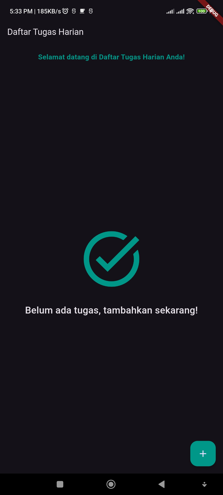

# Dicoding "Belajar Membuat Aplikasi Flutter untuk Pemula" Course


## 📖 Introduction

Welcome to the **Wisata Bandung** repository! This project is part of my journey in completing the **Dicoding Academy** course titled [Belajar Membuat Aplikasi Flutter untuk Pemula](https://www.dicoding.com/academies/159). It covers essential concepts of Flutter app development, including:

- Building layouts
- Managing state
- Responsive design
- Navigation
- Flutter Web support

This repository contains the solutions to the course modules, along with the final project submission.

## 📂 Contents

This repository is structured into the following sections:

### 1. **[CODELAB 1: Flutter Basics](./codelab_1)**
   - Introduction to Flutter widgets
   - Building the main structure of the app
   - Using basic components like `Scaffold`, `AppBar`, and `Text`

### 2. **[CODELAB 2: Navigation and Routes](./codelab_2)**
   - Implementing multi-screen navigation
   - Creating routes and integrating them into the app
   - Using `Navigator` and `MaterialPageRoute`

### 3. **[CODELAB 3: Stateful Widgets](./codelab_3)**
   - Understanding and managing state
   - Implementing dynamic user interactions
   - Utilizing stateful widgets like `setState`

### 4. **[CODELAB 4: Responsive Web Development](./codelab_4)**
   - Building responsive layouts
   - Adding support for Flutter Web
   - Creating adaptive designs for desktop, tablet, and mobile devices

### 5. **[FINAL PROJECT: Daily Task Manager](./path/to/final-project-folder)**

The final project is a **Daily Task Manager App** that helps users keep track of their daily to-do list. The app includes several essential features designed to enhance user experience and productivity.

#### Features:
- **Add New Tasks**: Users can add tasks with ease using the "Add Task" button.
- **Mark Tasks as Complete**: Checkboxes allow users to mark tasks as completed. Completed tasks are visually distinguished with a strikethrough.
- **Delete Tasks**: Swipe-to-delete functionality makes it simple to remove tasks, with confirmation dialogs to prevent accidental deletions.
- **Welcome Message**: A greeting widget displays a welcoming message to make the app more engaging.
- **No Tasks Illustration**: If no tasks are added, the app provides a visual cue encouraging the user to add tasks.
- **Responsive Layout**: The app adapts seamlessly to different screen sizes and orientations.
- **Light and Dark Theme Support**: The app respects the device's theme settings for a consistent user experience.

## 🚀 How to Run the Project

To run this project on your local machine:

1. Clone the repository:
   ```
   git clone https://github.com/ramhaidar/LearnFlutter.git
   cd your-repo-name
   ```

2. Install dependencies:
   ```bash
   flutter pub get
   ```

3. Run the app:
   ```bash
   flutter run
   ```

   For Flutter Web:
   ```bash
   flutter run -d chrome
   ```

4. Ensure you have a working Flutter environment set up. Refer to the [official documentation](https://flutter.dev/docs/get-started/install) if needed.

## 🎯 Features

- Responsive layouts for all screen sizes
- Intuitive navigation
- Interactive UI with dynamic state handling
- Cross-platform support (Android, iOS, Web)

## 🛠 Tools and Technologies

- **Flutter**: The primary framework for building the application
- **Dart**: The programming language used
- **VS Code / Android Studio**: Recommended IDEs
- **GitHub**: For version control and collaboration

## 📚 Learnings and Insights

During this course, I gained valuable insights into:

- Writing clean and maintainable Flutter code
- Building adaptive layouts for various platforms
- Managing state and navigation effectively
- Debugging and testing Flutter applications

## 📸 Screenshots

### Mobile View:


### Web View:


## 📜 License

This project is licensed under the MIT License. See the [LICENSE](./LICENSE) file for details.

---

Feel free to explore the repository, and I welcome any feedback or contributions!
